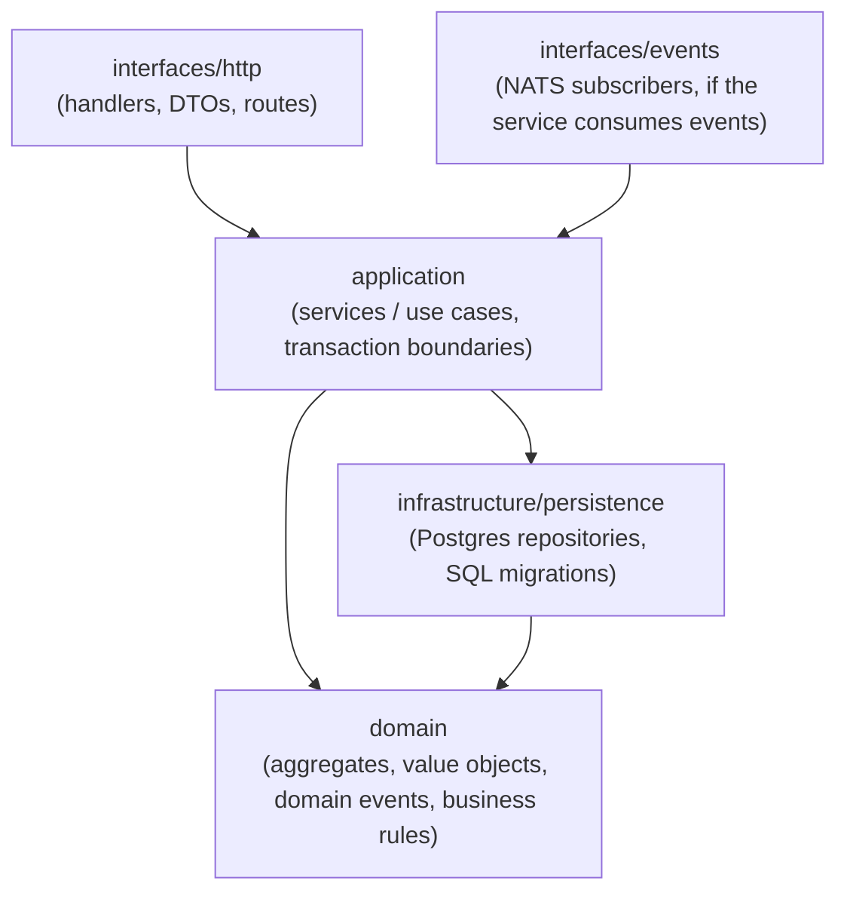
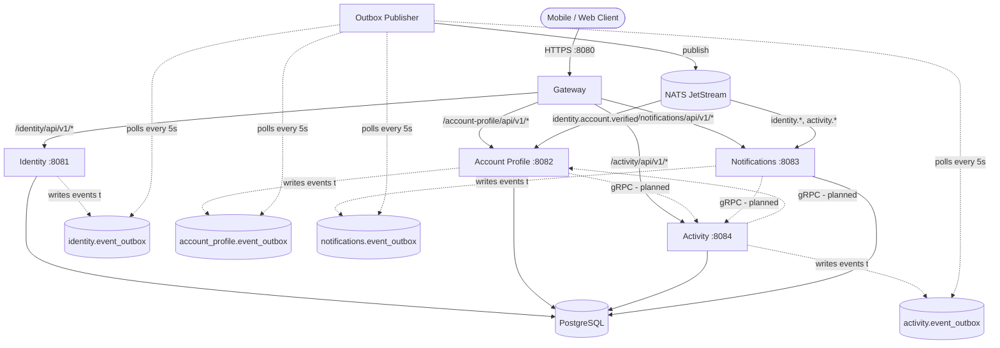
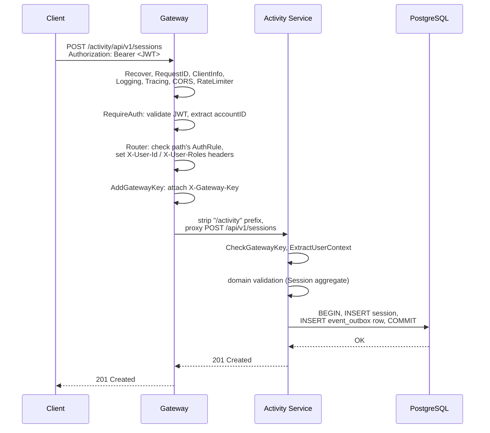
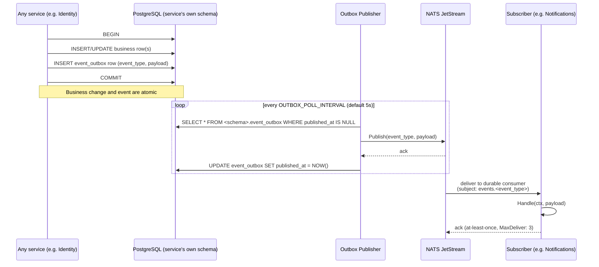

# Rekreativko API

A microservices-based backend API for the Rekreativko platform, built with Go using Domain-Driven Design (DDD) principles.

## Architecture

This is a **service-centric monorepo** where each service is independently deployable but shares common infrastructure code.

### Services

- **Gateway** (`:8080`) - single entry point: JWT authentication, routing, CORS, rate limiting. Owns no database, no business logic. [→ README](gateway/README.md)
- **Identity** (`:8081`) - registration, login, email/phone verification, JWT issuance, refresh-token rotation. [→ README](identity/README.md)
- **Account Profile** (`:8082`) - user profiles, per-account settings, activity interests. [→ README](account-profile/README.md)
- **Activity** (`:8084`) - the core domain: activity groups, sessions, invites, RSVP/attendance, recurring session templates. Also ships a separate one-shot cron job (session generation, invite/session expiry). [→ README](activity/README.md)
- **Notifications** (`:8083`) - in-app notification feed, plus identity's account-lifecycle email/SMS delivery. [→ README](notifications/README.md)
- **Outbox Publisher** - background worker relaying every service's domain events from its database outbox to NATS. The only service that publishes to NATS. [→ README](outbox-publisher/README.md)

Each service above has its own README with full API reference, domain model, configuration, and known issues — this file covers the system as a whole.

### Technology Stack

- **Language**: Go 1.26
- **Database**: PostgreSQL
- **Message Broker**: NATS
- **Cache**: Redis
- **Observability**: OpenTelemetry, Jaeger, Prometheus, Grafana
- **Containerization**: Docker

## Project Structure

```
.
├── activity/              # Activity service
│   ├── cmd/
│   │   ├── api/          # HTTP API server
│   │   └── cron/         # Background job worker
│   └── internal/
│       ├── application/  # Use cases
│       ├── domain/       # Business logic
│       ├── infrastructure/
│       │   └── persistence/
│       │       └── migrations/
│       └── interfaces/   # HTTP handlers
├── account-profile/       # Account profile service
│   ├── cmd/api/
│   └── internal/
├── identity/             # Identity service
│   ├── cmd/api/
│   └── internal/
├── notifications/        # Notification feed + identity email/SMS delivery
│   ├── cmd/api/
│   └── internal/
├── gateway/              # API Gateway
│   ├── cmd/api/
│   └── internal/
├── outbox-publisher/     # Outbox pattern publisher
│   ├── cmd/worker/
│   └── internal/
├── shared/               # Shared libraries
│   ├── api/             # HTTP utilities
│   ├── config/          # Configuration
│   ├── domainerror/     # Error handling
│   ├── events/          # Event broker
│   ├── logger/          # Structured logging
│   ├── middleware/      # HTTP middleware
│   ├── notification/    # Email/SMS notifications
│   ├── store/           # Database connections
│   ├── telemetry/       # Observability
│   └── token/           # JWT & password utilities
└── build/
    └── Dockerfile       # Multi-service Dockerfile
```

## How Each Service Is Built

Every service (except the thin `gateway`) follows the same DDD/hexagonal layering, so once you understand one, you understand all of them:



- **`domain`** has no dependencies on anything else — it's plain Go structs, value objects, and business-rule methods (e.g. `Session.canManageSession`, `Attendee.Approve`). Domain methods raise domain events but never touch the database or NATS directly.
- **`application`** orchestrates: it loads aggregates via a repository interface, calls domain methods, persists the result, and writes any raised events to that service's own `event_outbox` table — all inside one DB transaction (see [Events](#how-events-are-used) below).
- **`infrastructure/persistence`** implements the repository interfaces `application` depends on (dependency inversion — `application` defines the interface, `infrastructure` provides the Postgres-backed implementation), plus the service's SQL migrations.
- **`interfaces/http`** and **`interfaces/events`** are the two ways the outside world reaches `application`: an authenticated HTTP request via the gateway, or an event delivered from NATS.

`gateway` and `outbox-publisher` don't have a domain layer — they're pure infrastructure (routing, and outbox-to-NATS relaying, respectively), not bounded contexts of their own.

## Request Flow

All external traffic enters through `gateway`, which is the only service with a published host port. It authenticates, then proxies to the right backend based on path prefix:



Solid arrows are live traffic today. Dashed arrows are two different things: the outbox/NATS lines (`writes events to`, `polls`, topic names) are the live async event pipeline described below; the **`gRPC - planned`** edges are **not implemented** — direct, synchronous service-to-service calls, planned for cross-service reads that don't fit the eventual-consistency model well (e.g. an activity-service analytics endpoint pulling live profile data, rather than waiting on an event to arrive). The edges shown are illustrative of the intent, not a finalized design — no gRPC code, `.proto` files, or ports exist in this repo yet.

Note only `account-profile` and `notifications` subscribe to anything on NATS — `identity` and `activity` are pure event *producers* in this system today.

### Planned: gRPC for internal service-to-service calls

**Not implemented yet.** Today the only way for one service to be affected by another is the async NATS event pipeline above — fine for "notify someone something happened," but a poor fit for a service needing an *immediate* answer from another service's data (e.g. an analytics/results view on `activity` that needs to read something live from `account-profile`, rather than waiting for that data to arrive via an eventually-consistent event). The plan is to add direct, synchronous gRPC calls between services for exactly that case, as a second communication path alongside — not a replacement for — the existing event bus:

- **Events (NATS, existing)**: "something happened, react whenever" — async, eventually consistent, one-to-many, decoupled from the publisher being up.
- **gRPC (planned)**: "give me this data right now" — sync, request/response, one-to-one, requires the callee to be up.

No `.proto` definitions, gRPC servers, or internal ports exist in this repo yet — this section documents intent so the shape doesn't get forgotten, not a shipped feature.

### A single request, step by step

Every request goes through the same gateway middleware chain before reaching a backend. Example: creating a session.



The two auth checks in the gateway (`RequireAuth` and the router's own `AuthRule`) are separately maintained lists that must independently agree a path is public or protected — see [`gateway/README.md`](gateway/README.md#auth-rules--two-separate-lists-must-be-kept-in-sync) for a real bug this caused.

## How Events Are Used

Every service uses the **transactional outbox pattern**: a domain event and the business change that caused it are written in the *same* database transaction, so they can never disagree (no "the row saved but the event didn't fire" case). Nothing publishes to NATS directly — only `outbox-publisher` does, by polling.



**Conventions:**
- Event type naming: `{context}.{aggregate}.{event}` (e.g. `identity.account.verified`, `activity.session.attendee.removed`).
- Each subscriber gets its own durable JetStream consumer per topic, named `{service}-{sanitized-subject}` — independent of any other service subscribed to the same topic, so one service's processing speed/failures never affect another's.
- Delivery is **at-least-once** (`AckPolicy: Explicit`, `MaxDeliver: 3`, 30s ack wait) — handlers must be idempotent, or at least tolerate redelivery, since a message can be redelivered if the consumer doesn't ack in time.
- If publishing succeeds but marking the outbox row as published fails, the event is republished next poll — the same at-least-once tradeoff from a different failure point (see [`outbox-publisher/README.md`](outbox-publisher/README.md)).

**Representative event flows in this system:**

| Trigger | Event | Consumer(s) | Effect |
|---|---|---|---|
| User registers | `identity.verification_code.created` | notifications | sends the verification code via email/SMS |
| User verifies their account | `identity.account.verified` | account-profile, notifications | account-profile creates a blank profile + default settings; notifications sends confirmation |
| Too many failed logins | `identity.account.locked` | notifications | sends a lockout alert |
| User requests to join a private group | `activity.member.join_requested` | notifications | notifies the group's managers |
| User RSVPs "going" on an approval-gated session | `activity.session.attendee.join_requested` | notifications | notifies the session's managers |
| A join request is approved/rejected | `activity.member.approved/rejected`, `activity.session.attendee.join_approved/rejected` | notifications | notifies the requester |
| A manager removes a confirmed attendee | `activity.session.attendee.removed` | notifications | notifies the removed user |
| A waitlisted attendee is auto-promoted | `activity.session.attendee.promoted` | notifications | notifies the promoted user |
| A group invite is sent/accepted/declined/expires | `activity.invite.*` | notifications | notifies the relevant party |

`identity` and `activity` publish several more event types (account registration, login attempts, group/session lifecycle transitions, etc.) that currently have no subscriber — see each service's own README for the full list.

## Getting Started

### Prerequisites

- [Go 1.26+](https://golang.org/dl/)
- [Docker & Docker Compose](https://docs.docker.com/get-docker/)
- [Task](https://taskfile.dev/) - Task runner (replaces Make)
- [golang-migrate](https://github.com/golang-migrate/migrate) - Database migrations

### Install Development Tools

```bash
task tools:install
```

This installs:
- golangci-lint
- golang-migrate
- swag (Swagger generator)

### Local Development Setup

1. **Clone the repository**
   ```bash
   git clone https://github.com/rasparac/rekreativko-api.git
   cd rekreativko-api
   ```

2. **Start infrastructure services**
   ```bash
   task docker:run:local
   ```
   This starts PostgreSQL, Redis, NATS, Jaeger, Prometheus, Grafana, and Swagger UI.

3. **Run migrations**
   ```bash
   task migrate:all:up
   ```

4. **Run a service locally**
   ```bash
   task run:gateway      # API Gateway
   task run:identity     # Identity service
   task run:activity     # Activity service
   ```

5. **Build all services**
   ```bash
   task build
   ```

## Development Commands

### Building

```bash
task build                    # Build all services
task build:gateway            # Build specific service
task build:activity           # Build activity (api + cron)
task build:identity           # Build identity service
task build:account-profile    # Build account-profile service
```

### Testing

```bash
task test                     # Run unit tests
task test:integration         # Run integration tests (requires Docker)
task test:all                 # Run all tests
task test:coverage            # Generate coverage report
task test:verbose             # Run tests with verbose output

# Per-service integration tests
task test:activity:integration
task test:identity:integration
task test:account-profile:integration
```

### Database Migrations

```bash
# Run migrations for all services
task migrate:all:up

# Per-service migrations
task migrate:activity:up
task migrate:identity:up
task migrate:account-profile:up

# Rollback migrations
task migrate:activity:down

# Create new migration
task migrate:create -- activity create_sessions_table
task migrate:create -- identity add_user_roles
```

### Code Quality

```bash
task lint                     # Run linter
task fmt                      # Format code
task check                    # Run fmt + lint + test:all
task clean                    # Clean test cache and containers
```

### Docker

```bash
task docker:up                # Start all services
task docker:down              # Stop all services
task docker:build             # Build all Docker images

# Build specific service images
task docker:build:gateway
task docker:build:activity
task docker:build:identity
```

### Running Services

```bash
task run:gateway              # Run gateway locally
task run:identity             # Run identity service
task run:activity             # Run activity API
task run:activity:cron        # Run activity cron jobs
task run:account-profile      # Run account-profile service
task run:outbox               # Run outbox publisher
```

## Environment Variables

Create a `.env` file in the root directory:

```env
# Database
DB_HOST=localhost
DB_PORT=5432
DB_USER=postgres
DB_PASSWORD=postgres
DB_NAME=rekreativko

# JWT
JWT_SECRET=your-secret-key
JWT_ACCESS_TOKEN_DURATION=15m
JWT_REFRESH_TOKEN_DURATION=7d

# NATS
NATS_URL=nats://localhost:4222

# Redis
REDIS_HOST=localhost:6379

# Telemetry
OTEL_EXPORTER_OTLP_ENDPOINT=http://localhost:4318
OTEL_TRACES_SAMPLE_RATE=1.0
```

## API Documentation

Swagger/OpenAPI docs are generated from annotations on the HTTP handlers (`identity`, `account-profile`, `activity`) and served by a standalone **Swagger UI container** — the services themselves have no swagger code or dependencies at all, in any build (dev or production).

**Generate the docs and start Swagger UI in one step:**
```bash
task docs:ui
```
Then open **http://localhost:8090** and use the dropdown in the top-left to switch between Identity, Account Profile, and Activity.

If you're already running `task docker:run:local`, the `swagger-ui` container starts automatically alongside the other infra (Postgres, Redis, NATS, Jaeger, Prometheus, Grafana) — you just need to (re)generate the docs whenever you change handler annotations:
```bash
task docs:swagger:all           # regenerate docs for all three services
task docs:swagger:identity      # or a single service
task docs:swagger:account-profile
task docs:swagger:activity

docker compose up -d --force-recreate swagger-ui   # pick up the new files
```

The generated `docs.go`/`swagger.json`/`swagger.yaml` files are build artifacts and are gitignored — don't commit them. `task docs:ui` handles generating them and refreshing the container together.

## Testing

### Unit Tests
Fast tests with no external dependencies:
```bash
task test:unit
```

### Integration Tests
Tests that require Docker (PostgreSQL via testcontainers):
```bash
task test:integration
```

### Coverage Report
```bash
task test:coverage
open coverage.html
```

## CI/CD

GitHub Actions workflow automatically builds and pushes Docker images to GitHub Container Registry on push to `main`.

Manual builds can be triggered via GitHub Actions UI by selecting a service and version.

## Observability

### Metrics
- Prometheus: http://localhost:9090
- Grafana: http://localhost:3000

### Tracing
- Jaeger UI: http://localhost:16686

### Logs
Structured JSON logs with configurable levels (debug, info, warn, error).

## Architecture Patterns

- **Domain-Driven Design (DDD)**: each service follows DDD with clear domain, application, and infrastructure layers — see [How Each Service Is Built](#how-each-service-is-built)
- **Hexagonal Architecture**: dependencies point inward toward the domain
- **Event-Driven**: services communicate via NATS event streams — see [How Events Are Used](#how-events-are-used)
- **Transactional Outbox**: reliable event publishing using a per-service database outbox table, relayed by a dedicated worker

## Contributing

1. Create a feature branch from `main`
2. Make your changes
3. Run `task check` to ensure code quality
4. Create a pull request

## License

[Your License Here]
